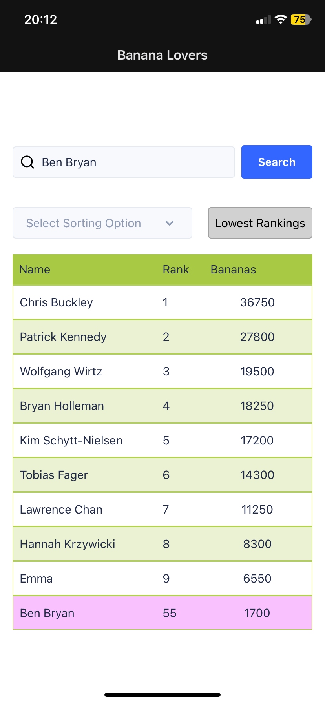

# hawk-bananas

This project is a React Native application that enables you to search for people in a leaderboard and how many bananas they have.

This is just a basic application and is only for show on how to search names, do fuzzy search and sort.


---

## **Features**

- **Leaderboard Table**: Displays a list of users with their names, ranks, and bananas.
- **Search Functionality**: Search for users by their name using a fuzzy search or exact match.
- **Sorting Options**: Sort by rank or name.
- **Highlighting**: Highlights a user when searched.
- **Redux Integration**: State management for users and search functionality.

---

## **Tech Stack**

- **React Native**: Front-end framework for mobile app development.
- **Redux**: For state management.
- **TypeScript**: Static typing for better code quality and maintainability.
- **UI Kitten**: For consistent and reusable UI components.
- **Expo**: This has been set up with Expo for development purposes.


---

## **Installation**

1. Clone the repository:
   ```bash
   git clone git@github.com:JackDust24/hawk-bananas.git
   ```
2. Navigate to the project directory:
   ```bash
   cd bananas
   ```
3. Install the depenencies:
    ```bash
   npm install
   ```

## **Usage**
**Running the App**
To run the app on expo

   ```bash
  npx expo start
   ```

Folder Strucutre:

   ```bash

src/
├── app/               # Layout and index home page
├── components/         # Reusable UI components (e.g., SearchBar, UserList)
├── data/               # Static JSON data (e.g., leaderboard.json)
├── helpers/            # Helper functions (e.g., fetchData)
├── redux/              # Redux actions, reducers, and store
├── types/              # TypeScript types and interfaces

   ```

**How to Use**
- Search for a User

1. Enter a username in the search bar (look at the leaderboard.json file)
2. Press the Search button to find the user.
3. If the user exists, their information will be highlighted in the leaderboard.
   
- View Rankings
1. The table displays the top 10 rankings by default.
2. Users can toggle between sorting by name or rank using the buttons below the search bar.
3. Tap the "Lowest Rankings" button to view users with the lowest ranks.